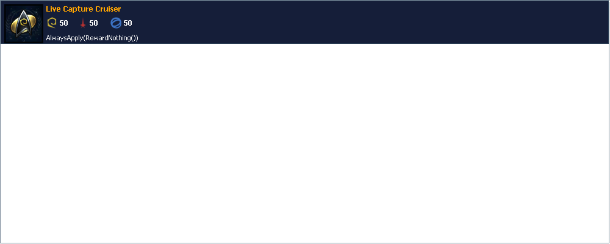
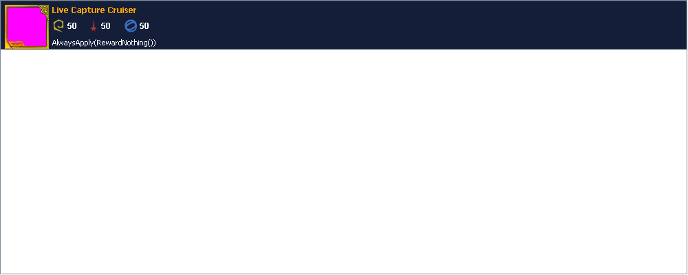

# Ship Artwork migration verification

Issue [18](../../.scratch/ship-artwork/issues/18-record-complete-migration-verification.md)
closes the verification stage of the [Ship Artwork specification](../../.scratch/ship-artwork/spec.md).
The implementation tested here was `e987504` on
`t3code/complete-migration-verification`. Checks ran on Windows 11 x64 on
September 27, 2026, using Eclipse Temurin JDK 25.0.4.1 and the committed
Gradle 9.7.1 wrapper. All tool invocations targeted isolated directories made
from repository fixtures; no user archive was used.

## Build and automated checks

With `JAVA_HOME=C:\OpenJDK\jdk-25`, `./gradlew.bat clean build` passed: 12
tasks executed, including Java compilation, the complete JUnit suite,
`ArchitectureTest`, `verifyThinJar`, `verifyExplodedBootstrap`, and
`verifyPackagedBootstrap`. The JUnit XML reports contain **424 tests in 42
suites, with zero failures, errors, or skips**. `ArchitectureTest` contributed
21 passing tests. The thin application JAR was built at
`build/libs/Admiralty-1.0.5-SNAPSHOT.jar`.

Before the clean build, focused runs passed for
`com.kor.admiralty.ui.artwork.*`, `ShipArtworkViewsTest`,
`ShipArtworkCharacterizationTest`, `ShipArtworkFilterLiveTest`,
`ShipArtworkLiveTest`, and `ShipRendererArtworkTest`. The
`shipArtworkToolDistribution` and `shipArtworkVisualBaseline` tasks also passed.
The direct operator launcher was used below so its process exit category was
preserved; a nonzero `shipArtworkTool` Gradle task instead becomes a Gradle
build failure.

## Offline operator checks

Each case copied the five production `data/*.csv` files and one immutable
[legacy fixture](../../test/resources/ship-artwork/legacy/README.md) into its
own `build/verification/ship-artwork-18-20260927/<case>` directory. The direct
Java 25 launcher ran separate `inspect`, `migrate`, and `verify` processes with
an absolute `--data-directory`, `--json`, and **no** `--online-refresh`:

```powershell
& .\build\ship-artwork-tool\bin\ship-artwork-tool.bat inspect --data-directory $caseDir --json
& .\build\ship-artwork-tool\bin\ship-artwork-tool.bat migrate --data-directory $caseDir --json
& .\build\ship-artwork-tool\bin\ship-artwork-tool.bat verify --data-directory $caseDir --json
```

| Legacy fixture | Inspect exit | Migrate exit | Verify exit | Migration report |
| --- | ---: | ---: | ---: | --- |
| `recognizable.zip` | 0 | 0 | 0 | 2 matched, 2 migrated |
| `recognizable-and-unmatched.zip` | 3 | 3 | 0 | 1 matched and migrated; 1 unmatched finding |
| `recognizable-and-unreadable.zip` | 3 | 3 | 0 | 1 matched and migrated; 1 unreadable finding |

All three resulting v2 archives passed an independent `verify` process. Before
and after each `inspect` and `verify`, the top-level target-file inventory
(file name, length, SHA-256, and UTC modification time) was identical. Each
legacy archive's SHA-256 was also unchanged by migration:

| Fixture | `icons.zip` SHA-256 before and after |
| --- | --- |
| Recognizable | `8B1907B3105768F99EF82488AE9E13545DDA8FE9E0250AAC96A23F002627669C` |
| Unmatched | `C6922EF674373D939FAC1330BFB5E2FF4338B9DEDA806295AABA59D8D5CC0EEA` |
| Unreadable | `1E746F8AD1972582539F8D8336BC5907D86E8FF94C19EA08420F10468DFAC5E0` |

These offline commands ran where network access was available. The successful
offline migration alone does not prove the transport guard; the passing
`ShipArtworkToolTest.offlineAcquisitionGuardFailsLoudly` explicitly checks
that an attempted acquisition fails. `inspectInventoriesLegacyAndV2WithoutWriting`,
`migratePreservesLegacyAndReportsUnmatchedEntry`, and
`verifyValidVersionedArchiveWithoutWriting` test the corresponding command
contracts with temporary directories. The fixture directories and raw command
logs were transient build output removed by the subsequent clean build; the
outcomes, fixture identities, and hashes above are the retained run record.

## Restart, recovery, and final flush

The focused artwork suite and clean build passed tests that close and reopen
Ship Artwork over real temporary archives:

| Behavior | Passing evidence |
| --- | --- |
| Versioned identity, freshness, integrity, and pixels survive restart | `ShipArtworkPersistenceTest.successfulArtworkSurvivesReopeningWithoutOverwritingLegacyArchive` and `archiveRecordsVersionedIdentityFreshnessAndIntegrityEvidence` |
| Legacy pixels remain available without replacing `icons.zip` | `ShipArtworkMigrationTest.migratedFallbackSurvivesRestartWithoutSuppressingAcquisition`, plus the operator SHA-256 checks above |
| Corrupt v2 state is quarantined or safely retained if quarantine fails | `ShipArtworkRecoveryTest.corruptArchiveIsQuarantinedBeforeRebuildingAcrossRestart` and `failedQuarantinePreservesCorruptionAcrossCloseAndRestart` |
| Completed work reaches durable state on close, even across interruption or an overlapping installation | `ShipArtworkTimingTest.interruptedCloseFlushesSuccessAndMakesUnfinishedRefreshDueAgain` and `finalFlushIncludesSuccessArrivingDuringEarlierInstallation` |

The offline tool's separate migration and verification processes additionally
demonstrate that their v2 results survive process exit.

## Retained visual evidence

`shipArtworkVisualBaseline` generated nine current Swing captures in
`build/ship-artwork-views/`. **All nine PNG files had the same SHA-256 as their
[retained baselines](../../test/resources/ship-artwork/views/README.md)**:
reusable Roster, One-Time Ships, Roster and GameData Starship Traits, reusable,
One-Time, and Roster-card selection, Ship usage, and Solution cards.
`ShipArtworkViewsTest` paints these production components and checks each
generic/specific artwork policy. Its platform-independent assertions do not
claim full-window pixel equality; the fresh captures provide that additional
comparison for this Windows/JDK environment.

`ShipArtworkCharacterizationTest` also passed the frozen generic and specific
composition comparisons across 420 faction/role/rarity tiles. The intended
live fallback-to-specific change also has a paired capture from one already
mounted reusable-Roster view. `--live-replacement` on the existing
`shipArtworkVisualBaseline` task holds a scripted source response, paints the
generic fallback, completes the source off the event thread, drains the Swing event
queue, and paints the same view and selected card again. It uses Metal in
headless mode, synthetic magenta source pixels, and no network. The handle,
list model, and selection identities are asserted stable. Both frames are
1000 × 400; exactly 4,096 pixels changed, within the artwork's 64 × 64 region
at `[7, 71) × [7, 71)`. The pair was inspected visually:

| Before source completion | After source completion |
| --- | --- |
|  |  |

Recreate the pair without replacing the checked-in images:

```powershell
.\gradlew.bat shipArtworkVisualBaseline --args='--live-replacement build/ship-artwork-live'
```

`ShipArtworkLiveTest` independently verifies the before/after handle pixels and
automatic event-thread repaint of visible owners; headless captures alone do
not prove an operating-system repaint. `ShipArtworkFilterLiveTest` checks that
completion keeps filter criteria, list models, visible order, selection, and
details layout. The nine retained surfaces still show no unintended pixel or
card-structure difference, and the paired capture shows only the intended
artwork replacement. No layout, filtering, or selection decision needs to be
reopened.

## Real online refresh — separate from automated tests

At approximately 00:18 PDT (07:18 UTC) on September 27, a direct Java 25 tool
process ran a **real** `migrate --online-refresh --json` against an isolated
seven-Ship target: the six `test/resources/gamedata` Ships plus the production
`APU Cruiser` row, with `recognizable-and-unmatched.zip` copied as `icons.zip`.
The request used the production GitHub acquisition path, outside the sandbox's
network restriction. Automated HTTP tests use scripted responses and are not
evidence of this live run.

The live report recorded **5 requested, 1 succeeded, 4 failed**, and process
exit **3** for the four failed sources and one unmatched legacy entry. The
successful v2 manifest identifies `APU_Cruiser.png` with a successful-source
timestamp of `2026-09-27T07:18:02.831205100Z`; the unsuccessful fixture sources
were `JemHadar_Vanguard_Carrier.png`, `IKS_Bortas.png`, `USS_Enterprise.png`,
and `RRW_Dhelan.png`. The report did not identify their underlying HTTP failure
causes. The migration retained the unmatched entry in `icons.zip`.

A subsequent **separate** `verify --json` process returned **0** with a valid
archive: one current entry, one stale migrated legacy entry, and one successful
source. Verification changed no target files. The legacy SHA-256 remained
`C6922EF674373D939FAC1330BFB5E2FF4338B9DEDA806295AABA59D8D5CC0EEA`;
the new v2 SHA-256 was
`F0157425411840F781D5884641B5E1FBEC9411D798D150AE81371D2A1B6CDA6E`.
This proves one live acquisition and durable verification, while the four
reported failures remain live-network findings rather than automated-test
failures.

## Final architecture check

`ArchitectureTest.retiredArtworkDeclarationsRemainAbsent` and
`shipArtworkModuleExposesOnlyItsNamedSeams` passed in the clean build. A source
scan found no production reference to the retired artwork factories, bridge,
`IconCache`, or loader. The `ui.artwork` package has one public application
implementation, [`ShipArtwork`](../../src/com/kor/admiralty/ui/artwork/ShipArtwork.java),
and the separate public headless [`ShipArtworkTool`](../../src/com/kor/admiralty/ui/artwork/ShipArtworkTool.java);
the remaining implementation classes are package-private. The architecture
guard limits the application seam to `open`, `forShip`, and `close`. No
compatibility interface or alternate Ship Artwork implementation remains.
